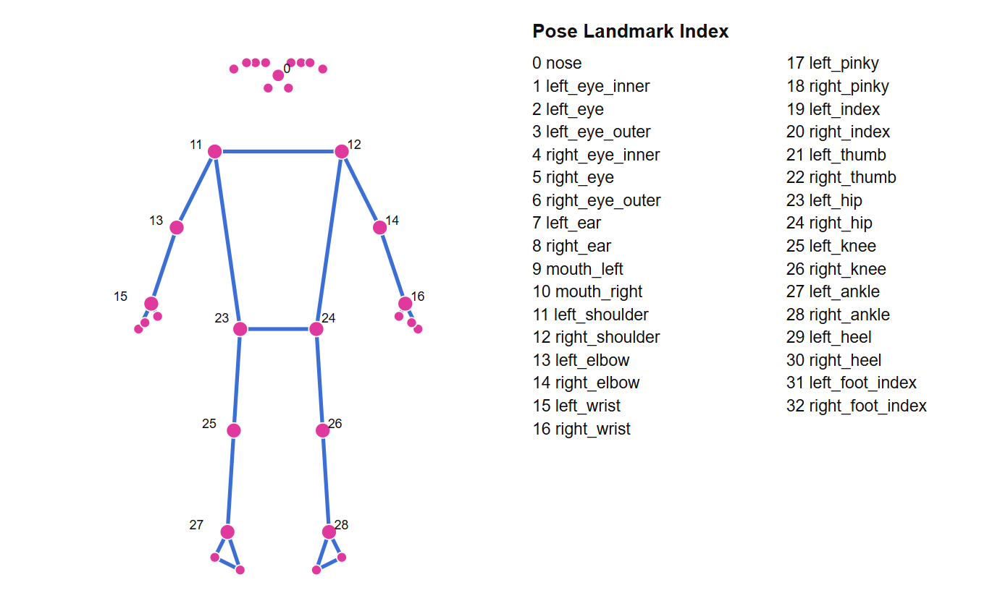

# Pose Angle Tracker

A real-time multi-joint pose estimation tool built with MediaPipe's Pose Landmarker (Tasks API) and OpenCV. Tracks and displays joint angles for both elbows, shoulders, hips, and knees simultaneously from a live webcam feed.

## Features

- Real-time full-body pose detection via webcam
- Simultaneous angle tracking for 8 joints: left/right elbow, shoulder, hip, and knee
- Visual skeleton overlay (joint dots + connecting lines)
- Per-joint angle values and labels rendered directly on the video feed
- Visibility-based filtering — skips drawing/calculating angles for joints that aren't confidently detected (e.g. out of frame or occluded), avoiding noisy or incorrect readings
- Easily extensible — add or remove tracked joints by editing a single list (`JOINTS_TO_TRACK`)

## How it works

1. Captures frames from the webcam using OpenCV.
2. Passes each frame to MediaPipe's `PoseLandmarker` (Tasks API), which returns 33 body landmarks with normalized `(x, y, z)` coordinates and a visibility/confidence score for each.
3. For each tracked joint, computes the interior angle formed by three landmarks (e.g. shoulder → elbow → wrist) using vector math (`arctan2`).
4. Draws the skeleton and overlays the live angle values and labels onto the video frame.
5. Runs continuously until `q` is pressed.

## Requirements

- Python 3.9–3.11 (MediaPipe does not yet reliably support 3.12+)
- A webcam

## Setup

1. Clone this repository and navigate into it:
   ```bash
   git clone <your-repo-url>
   cd <your-repo-folder>
   ```

2. (Recommended) Create and activate a virtual environment:
   ```bash
   python -m venv venv
   # Windows
   venv\Scripts\activate
   # macOS/Linux
   source venv/bin/activate
   ```

3. Install dependencies:
   ```bash
   pip install -r requirements.txt
   ```

4. Download the MediaPipe Pose Landmarker model file and place it in the project root as `pose_landmarker.task`:
   ```bash
   curl -L -o pose_landmarker.task https://storage.googleapis.com/mediapipe-models/pose_landmarker/pose_landmarker_lite/float16/latest/pose_landmarker_lite.task
   ```
   (Swap `lite` for `full` or `heavy` in the URL for higher accuracy at the cost of speed.)

## Usage

```bash
python pose_angle_tracker_tasks.py
```

A window will open showing your webcam feed with the pose skeleton and live joint angles overlaid. Press `q` to quit.

## Project structure

```
.
├── pose_angle_tracker_tasks.py   # main script
├── requirements.txt
├── pose_landmarker.task          # model file (downloaded, not tracked in git)
└── README.md
```

## Landmark index reference

MediaPipe Pose always outputs the same 33 landmarks in this fixed order. Use these indices when adding new joints to `JOINTS_TO_TRACK`:



## Extending

To track a different or additional joint, add an entry to `JOINTS_TO_TRACK` in `pose_angle_tracker_tasks.py`:

```python
JOINTS_TO_TRACK = [
    ("Label", POINT_A, VERTEX_POINT, POINT_C),
    ...
]
```

The angle is always measured at the middle (vertex) point.

## Notes

- Built on MediaPipe's newer Tasks API (`mediapipe.tasks.python.vision.PoseLandmarker`) rather than the deprecated `mp.solutions.pose` API.
- `pose_landmarker.task` is a downloaded model file and should be excluded from version control (see `.gitignore` below) due to its size.

## .gitignore suggestion

```
venv/
__pycache__/
*.pyc
pose_landmarker.task
```
